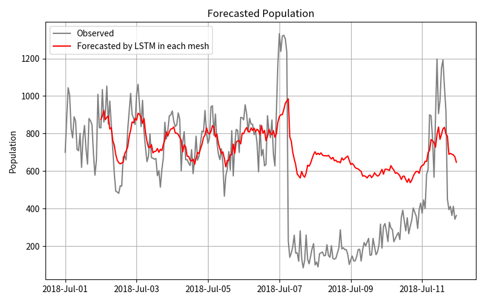

# Report for This LSTM model 
Elapsed time: 5.38 min

File created time: 20241016-0538-56

## Result 

- MAPE	102.6%
- MSE 	83983.38
- RMSE : 289.80

## Pickle path
./pickles/20241016-0538-56-spl/vars.pickle

## Mesh path
../csv_data/meshID/ID_Kurashiki_Mabicho_shelter.csv

## Imput vars

### Exo data:
- True

### Period:
- train_start_date    = 2016-01-01 00:00:00
- train_end_date      = 2018-06-30 23:59:59
- test_start_date     = 2018-07-01 00:00:00  
- test_end_date       = 2018-07-11 23:59:59

### LSTM parameter
- window_size	24
- epochs	30
- n_layers	1

