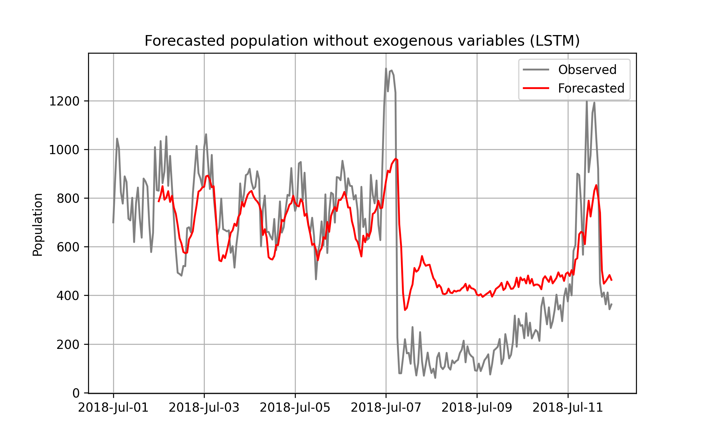

# Report for This LSTM model

File created time: 20240920-124748

## MeshID
../csv_data/meshID/ID_Kurashiki_Mabicho_shelter.csv

## Imput vars

### Exo data:
- False

### Exogenous data:
- population, precipitation, temperature, windspeed
 
### Period:
- train_start_date    = 2016-01-01 00:00:00
- train_end_date      = 2018-06-30 23:59:59
- test_start_date     = 2018-07-01 00:00:00  
- test_end_date       = 2018-07-11 23:59:59

### LSTM parameter
- window_size	24
- epochs	15

- feature_size	1
- n_hidden	64
- n_layers	2
- net

     MyLSTM(
  (lstm): LSTM(1, 64, num_layers=2, batch_first=True)
  (fc): Linear(in_features=64, out_features=1, bias=True)
)

## Result 

- mape	83.3
