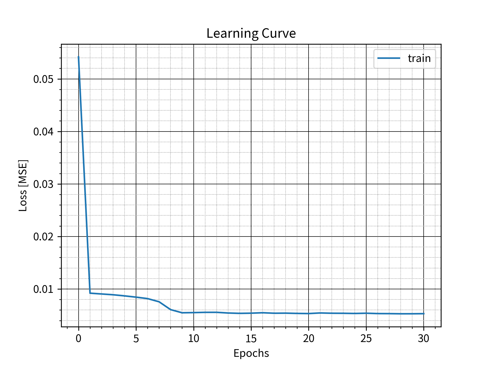
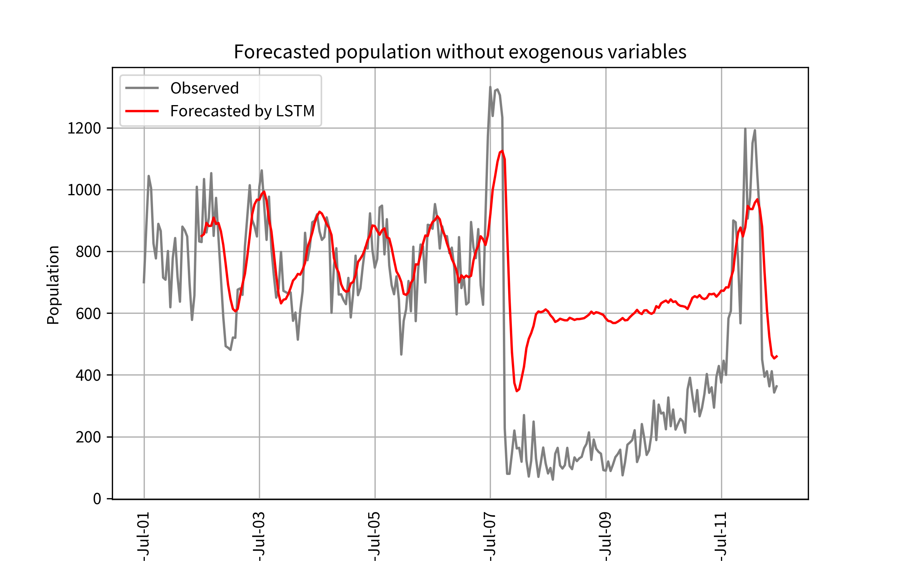

# Report for This LSTM model (Elapsed time: 0.33 min)

File created time: 20241015-1209-21

## Result 

- MAPE	116.4%
- MSE 	77308.99
- RMSE : 278.04

## Pickle path
./pickles/20241015-1209-21/vars_exoFalse.pickle

## Mesh path
../csv_data/meshID/ID_Kurashiki_Mabicho_shelter.csv

## Imput vars

### Exo data:
- False

### Exogenous data:
- population, prec, temp, wind, 雷注意報, 大雨注意報, 洪水注意報, 強風注意報, 大雨警報, 洪水警報, 暴風警報, 大雨特別警報
 
### Period:
- train_start_date    = 2018-02-01 00:00:00
- train_end_date      = 2018-06-30 23:59:59
- test_start_date     = 2018-07-01 00:00:00  
- test_end_date       = 2018-07-11 23:59:59

### LSTM parameter
- window_size	24
- epochs	30
- ...
- feature_size	1
- n_hidden	64
- n_layers	1
- net

     MyLSTM(
  (lstm): LSTM(1, 64, batch_first=True)
  (fc): Linear(in_features=64, out_features=1, bias=True)
)

