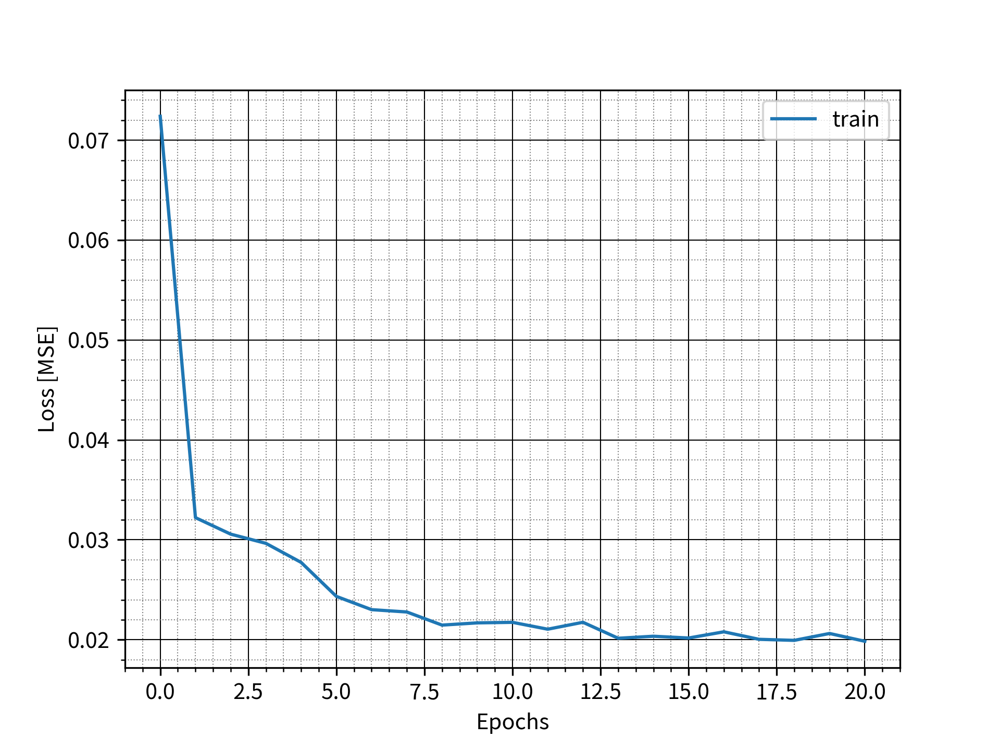
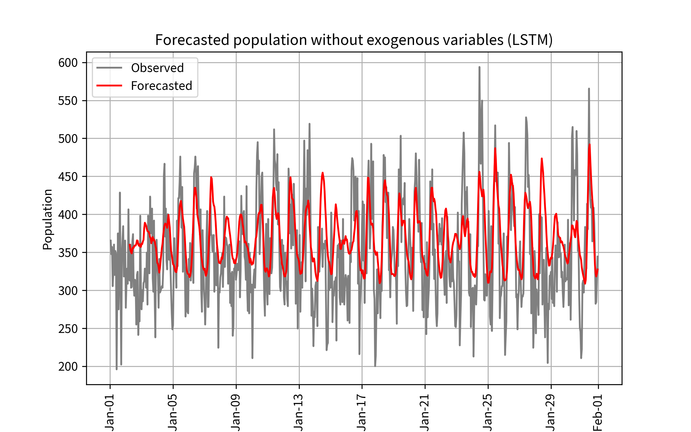
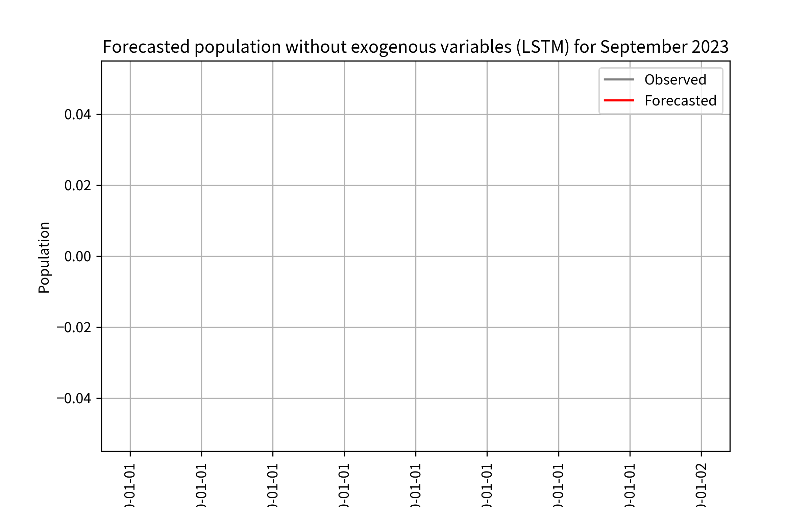

# Report for This LSTM model (Elapsed time: 0.26 min)

File created time: 20240924-051251

## Result 

- MAPE	14.8%
- MSE 	3419.21

## Pickle path
./pickles/20240924-051251/vars_exoFalse.pickle

## Imput vars

### Exo data:
- False

### Exogenous data:
- population, prec, temp, wind, 雷注意報, 大雨注意報, 洪水注意報, 強風注意報, 大雨警報, 洪水警報, 暴風警報, 大雨特別警報
 
### Period:
- train_start_date    = 2022-10-01 00:00:00
- train_end_date      = 2022-12-31 23:59:59
- test_start_date     = 2023-01-01 1:00:00  
- test_end_date       = 2023-01-31 23:59:59

### LSTM parameter
- window_size	24
- epochs	20
- ...
- feature_size	1
- n_hidden	64
- n_layers	2
- net

     MyLSTM(
  (lstm): LSTM(1, 64, num_layers=2, batch_first=True)
  (fc): Linear(in_features=64, out_features=1, bias=True)
)

